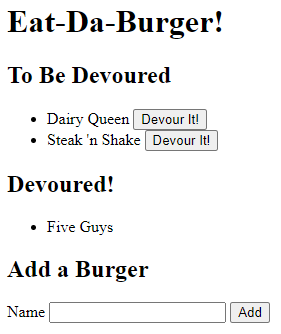

# Eat-Da-Burger
  
  ## Description
  Burger logger with MySQL, Node, Express, Handlebars, and a homemade ORM following the MVC design pattern.

  Enter the description of a burger that you would like to eat in the form at the bottom of the page. It will be displayed in the 'To Be Devoured' list. When you have eaten the burger, click the 'Devour It!' button. The burger will move to the 'Devoured!' list.

  The front end could use some more styling. I was happy just to get the MVC paradigm working. I think I'm also passing some unnecessary object properties around in the event listener code. When I have more experience with MVC, I'll come back to this to see if I can clean it up a little.

  Deployed at [Heroku](https://dry-bastion-75967.herokuapp.com/).

  See the repo at [GitHub](https://github.com/danielryangreen/burger).

  
  ## Table of Contents
  * [Installation](#installation)
  * [Usage](#usage)
  * [Credits](#credits)
  * [License](#license)
  * [Contributing](#contributing)
  * [Tests](#tests)
  * [Questions](#questions)
  ## Installation
  Navigate to the `db` directory in the terminal. Log in to MySQL from the command line using `mysql -u root -p`. Enter `source schema.sql` and `source seeds.sql` to create and populate the database. Then `exit` the MySQL command line tool.
  
  To install required packages, navigate back to the `burger` directory and enter `npm i` in the terminal.
  ## Usage
  To run the application, enter `node server.js` in the terminal and then navigate to `localhost:8080` in the browser.

  ## Credits
  The following resources were used in this project:

  - [MySQL](https://dev.mysql.com/downloads/mysql/)
  - [Node.js](https://nodejs.org/en/)
  - [Express](https://expressjs.com/)
  - [Handlebars](https://handlebarsjs.com/)

  - [npm mysql](https://www.npmjs.com/package/mysql)
  - [npm express](https://www.npmjs.com/package/express)
  - [npm express-handlebars](https://www.npmjs.com/package/express-handlebars)
  ## License
  This project is covered under the MIT license.
  ## Contributing
  Please submit a pull request.
  ## Tests
  Not provided.
  ## Questions
  Please contact me at dan.ryan.green@gmail.com. See my work on GitHub at [danielryangreen](https://github.com/danielryangreen/).